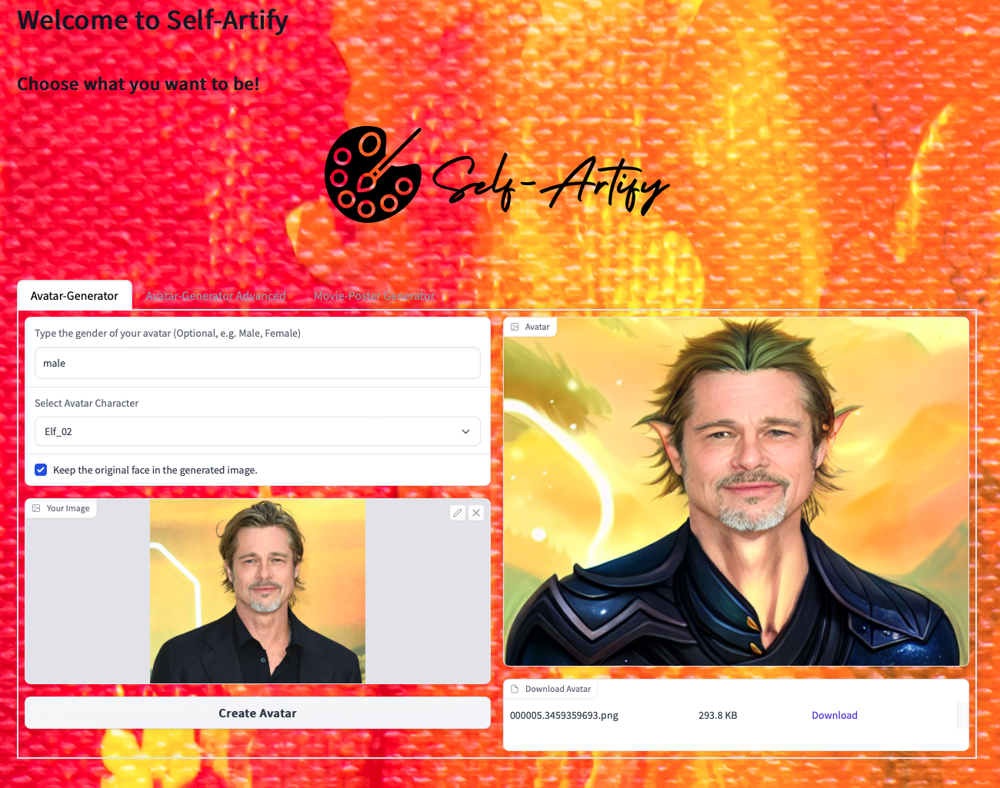
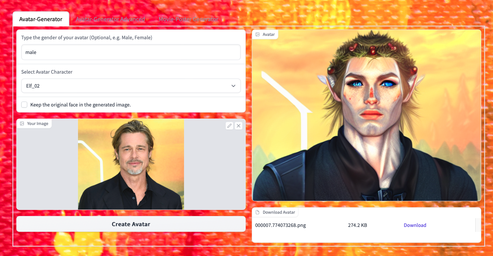

<h1 align='center'><b>Welcome to Self-Artify</b></h1>

This repository is a fork of
[invoke-ai/InvokeAI](https://github.com/invoke-ai/InvokeAI) which is based on the open source text-to-image generator [CompVis/stable-diffusion](https://github.com/CompVis/stable-diffusion)

By using the above mentined code base we developed a web app that lets users to create fantasy avatars.

## Web app Usage
### Avatar-Generator
The user uploads a selfie (ideally an image with a clear frontal face, half torso with a natural background). 
If the user selects "keep the original face in the generated image option" the face in the image is identified and masked. Then, the original image and the masked image are used as the inputs to the stable diffusion's [inpaint functionality](https://github.com/invoke-ai/InvokeAI/blob/main/docs/features/INPAINTING.md) with preselected prompts for each fantasy character option.

If the "keep the original face in the generated image option" is not selected, then only the original image and the respective prompts is used with stable diffusion's  [image to image functionality](https://github.com/invoke-ai/InvokeAI/blob/main/docs/features/IMG2IMG.md). 

The 

The developers of [invoke-ai/InvokeAI](https://github.com/invoke-ai/InvokeAI) created a streamlined process with various new features and options to aid the image
generation process. It runs on Windows, Mac and Linux machines,
and runs on GPU cards with as little as 4 GB or RAM.

Follow the installation from Invoke AI https://github.com/invoke-ai/InvokeAI/blob/main/README.md

